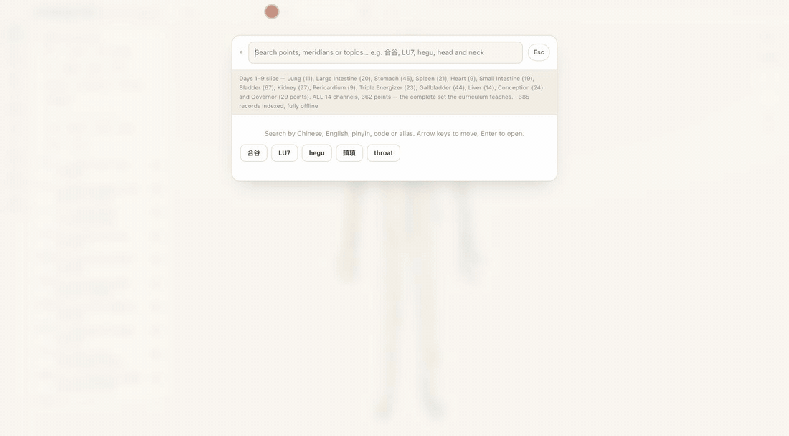

# Let Energy Flow · 炁流

A local-first, offline, installable web app for memorising the TCM meridian
system and its 362 acupoints — the twelve regular channels, 任脈 and 督脈, and
the 奇經八脈 as a distinct layer — on an original SVG body atlas, a
subway-style energy network map, and a 26-day structured curriculum.

**Educational use only.** It does not diagnose, does not recommend points for
symptoms, and contains no needling, bloodletting or other invasive technique
instructions. That boundary is enforced by tests, not by tone — see
[CONTRIBUTING.md](CONTRIBUTING.md) for the red lines.



## What this repository is (and is not)

This is the **open code set** of a project maintained in a private origin
repository. Three things about the split are worth knowing before you read
the data files:

- **The course materials are not here.** The private origin ingests a 26-day
  training-camp curriculum (someone's copyrighted teaching material) through
  owner-written editorial worksheets. This repository carries the *resulting
  curated dataset* — restated, typed, cited — never the source texts.
- **`src/data/indications.model.ts` ships empty, by design.** In the private
  origin that file holds 功效/主治 written from model knowledge for personal
  study; that content is licensed for one person's private use and is not
  publishable. An invariant test fails if any field here ever cites
  `src_model_unverified`. Points whose ingested sources are silent honestly
  show that they are silent.
- **A few provenance suites skip here.** They verify curated strings
  character-by-character against the private worksheets and detect their
  absence. Every dataset-only safety guard still runs.

## Run it

```bash
npm install     # first time only
npm run dev     # http://localhost:5173
```

Other scripts:

```bash
npm run typecheck    # tsc --noEmit
npm test             # vitest run
npm run build        # typecheck + production build into dist/
npm run build:shared # the deploy build + a verifier that greps dist/ for leaks
npm run preview      # serve the production build (service worker active here)
```

No account, no server, no analytics. Progress lives in this browser's
`localStorage` and can be exported or erased from the Settings screen (⛭).

Two language settings, and the split is a content rule rather than a
preference. **Content display** chooses between the 中文 a claim was read in
and this project's own English rendering of it (or both). **Interface
language** translates the chrome — buttons, navigation, headings — into
繁體中文, 简体中文, English, Français, Deutsch, Español, Italiano, Magyar,
Русский or Українська, following the browser's language by default.

Curated material never follows the interface setting. The 定位 location texts,
point and channel names, classical quotations and the curriculum stay in the
中文 they were read in and the English this project wrote, because a French or
Russian rendering of a medical source is one nobody has read — inventing it is
what `AGENTS.md` forbids outright. 简体 is produced from the 繁體 chrome by a
hand-checked conversion table (`src/i18n/hans.ts`) that is cross-checked in
tests against the dataset's own reviewed 繁/简 name pairs, and it is applied
ONLY to strings in the generated chrome registry — never to a sourced string.
The Latin display face is Source Serif 4 (SIL OFL 1.1 — licence at
`public/fonts/OFL-Source-Serif-4.md`); CJK text uses system fonts.

## What's inside

All fourteen channels — **手太陰肺經 (LU, 11)**, **手陽明大腸經 (LI, 20)**,
**足陽明胃經 (ST, 45)**, **足太陰脾經 (SP, 21)**, **手少陰心經 (HT, 9)**,
**手太陽小腸經 (SI, 19)**, **足太陽膀胱經 (BL, 67)**, **足少陰腎經 (KI, 27)**,
**手厥陰心包經 (PC, 9)**, **手少陽三焦經 (TE, 23)**, **足少陽膽經 (GB, 44)**,
**足厥陰肝經 (LR, 14)**, **任脈 (CV, 24)** and **督脈 (GV, 29)** — **362 points**,
plus all eight 奇經八脈 drawn as routes through their 交會腧穴 (督/任 own their
points; the other six borrow, and the data model keeps "owns a point" and
"passes through it" as different facts).

The curriculum spans **26 days** (184 flashcards, 135 quiz items with
explanatory feedback): Days 1–10 load the channels, Day 11 the 特定穴 matrix,
Day 12 a whole-set consolidation, Day 13 the 子午流注 clock, and Days 14–26
re-cover the body as regional detail sessions — wrist/hand, elbow/forearm,
shoulder, chest, abdomen, flank and 帶脈, knee, head, face, neck, hip/thigh,
ankle/foot, back — each region a tighter grid of the same records.

| Area | State |
| --- | --- |
| SVG body atlas | Original 7.5-head mannequin with face, joint contours and articulated hands/feet; front/back views, zoom / pan / fit, keyboard + touch; per-channel layer panel with 陰/陽, 手/足, 表/裡 group toggles and 奇經八脈 as a peer layer; mirror/symmetry mode (auto-enabled on single-channel focus) with 帶脈 drawn as belt arcs |
| Extremity detail views | Hotspot on each hand and foot opens a zoomed modal rendering the SAME geometry through a tighter viewBox; every 井穴 / 滎穴 / 輸穴 label fits, staggered into free slots with leader lines |
| Global search | Offline, grouped into points / meridians / topics; matches code, 繁體, 简体, pinyin, English, alias, region, landmark; one-character typo tolerance on Latin queries. 主治 content is deliberately NOT indexed |
| Search → camera | Point result centres and magnifies with neighbours kept visible; meridian result fits the whole route and quiets the others; topic result highlights every loaded related record |
| Energy network map | Subway-style, stations read from the same records, station → atlas cross-link, ordered text equivalent |
| 流注 Flow (子午流注) | Twelve-hour clock: follows system time, or drag/tap the ring, arrow-key it, or swipe the figure; front AND back shown together, the hour's channel lit on both sides from the canonical geometry. Educational only — no treatment-timing or lifestyle guidance, and a test rejects 宜/忌/養生/排毒 wording |
| 十二經運行 Circuit | Its own page: the closed loop of the twelve channels as three laps of 手陰→手陽→足陽→足陰, all segments flowing simultaneously, seated 《靈樞》 quotes, 陰升陽降 flank text in 直書, and 全部/只看陰/只看陽/只看升/只看降 emphasis toggles |
| Learning loop | 26-day lessons with a day picker, flashcards, locate-the-point on the atlas, quiz with explanatory feedback |
| 特定穴 matrix (Day 11) | Six tabs — 五輸穴 / 原絡郄 / 募俞 / 八會穴 / 八脈交會 / 下合穴 — built from each point's reviewed `classifications`, never authored twice; a test fails if a category stops being complete |
| Review | 1-3-7-14-30 spacing, per-item boxes, per-point mastery, error notebook with a "why did I mix these up" field |
| Design | "Atlas Editorial" system: paper-first light + warm ink dark theme, Source Serif 4 display type, glow-ring markers; mobile bottom bar → desktop left rail; reduced-motion respected |

## Placement rule — landmark first, always

Every acupoint coordinate is derived from a **fixed surface landmark plus a
bone-cun (骨度分寸) distance**, taken from that point's own reviewed 定位 text.
No coordinate is estimated by eye. `src/data/acupoints.ts` holds a single
anchor table `A`; a test fails the build if any entry in it is a bare
`{ x: …, y: … }` literal.

```bash
npx tsx scripts/audit-landmarks.ts --all
```

The audit re-reads all 362 定位 texts, extracts the distance and the landmark
it is measured **from**, and compares it with what the marker implies. All 171
points that state a bone-cun distance currently sit at **0.0 cun drift**; the
other 191 are located qualitatively (a knuckle, a nail corner, a palpable
depression) and are anchored to the drawn extremity, face and spine frames
instead. `src/data/landmark.test.ts` enforces both halves on every run.

Bone-cun is a **proportional** system: each segment is divided into its own
fixed number of units, so one cun is a different number of pixels in each
segment. Each scale is derived from the two landmarks bounding its own
segment (the tables live in `src/data/atlas.ts`), which is what lets a point
land at its stated distance from its own anchor even where the schematic's
proportions differ from a body's — and they do, because the figure is drawn
to a 7.5-head artistic canon, not to bone-cun.

**Known schematic distortions**, all documented in the source: the drawn navel
sits high, so one cun of lower abdomen is about twice one cun of upper abdomen;
the front view flattens the scalp arc to an even ladder; the neck is narrower
than a body's, so 扶突 / 人迎 / 天鼎 / 天窗 are offset by the neck's own width
rather than by trunk cun. Landmark anchoring makes coordinates reproducible
and internally consistent — it does **not** make them validated anatomical
coordinates, and every placement stays `schematic_unvalidated`.

The one externally derived measurement: the back-view vertebral ladder's
spacing proportions come from the HuBMAP CCF 3D Reference Object Library
(CC BY 4.0 — full attribution in [NOTICE](NOTICE) and on the app's About page).

## Two review statuses, not one

A record's **content** status and its **marker coordinate** status are
separate, and the app reports them separately:

- The 定位 text can be `source_checked` while the dot on the figure is still a
  layout position. Every placement is `schematic_unvalidated` today, stated per
  point in its detail panel, and stays that way until someone measures it.
- A **reviewed "none"** is distinct from a blank. 天池 PC1 and 三陽絡 TE8 carry
  no specific-point category *because the editorial pass determined they have
  none*, so they read 「無（經編審確認）」 rather than 「尚未記錄」. Fields
  nobody has looked at still read as not recorded.

## Content status — read this before trusting anything on screen

**Content is `source_checked` (owner editorial passes, August 2026), not
expert-reviewed.** No independent qualified reviewer has signed off yet, and
the app shows each record's own status.

- **Names, codes, route order** — restated in the project's own wording from
  long-circulating classical material, checked against GB/T 12346-2021, WHO
  Standard Acupuncture Point Locations (2008) and classical texts per entry.
  No single source is treated as authoritative.
- **Locations** — all 362 points carry 定位 from the owner's editorial
  worksheets (private origin, 2026-08), citing GB/T 12346-2021 per entry;
  status `source_checked`. English wording is the project's own translation of
  the reviewed 中文 and is itself unreviewed. Clinical indications, needling
  technique and contraindication content in the worksheets' remark fields was
  deliberately NOT ingested.
- **Atlas coordinates** — layout positions on this project's schematic figure,
  flagged `schematic_unvalidated`. They are *not* validated anatomical
  coordinates and must not be used to find a point on a body.
- **Traditional functions** — recorded as mnemonic/teaching associations with
  their sources, framed as education, never as guidance.
- **功效/主治 fields** — only where an ingested file attests them, cited
  per field; the model-written personal-study layer of the private origin is
  absent here (see above), so many points honestly carry none.

The 子午流注 hour-to-channel table (`src/data/shichen.ts`) comes from
**《針灸大成·十二經納地支歌》** (Yang Jizhou, Ming), editorial pass 2026-08-08.
The app displays ordinary clock hours, not 真太陽時, and says so on the page —
it times nothing. The scheme's applications (納甲法, 按時取穴, 開穴/閉穴) are
treatment decisions: not taught, not examined, and rejected by tests if they
appear. The same discipline runs through the curriculum: the handbook days
whose sections were symptom-grouped prescriptions or clinical case exams say
so in the lesson and teach routes, locations and classifications instead.

## Licensing

| What | Licence |
| --- | --- |
| Code | [Apache License 2.0](LICENSE) |
| Curated dataset (see scope in [LICENSE-DATA.md](LICENSE-DATA.md)) | CC BY-SA 4.0 |
| Vertebral-ladder spacing proportions | CC BY 4.0 (HuBMAP — [NOTICE](NOTICE)) |
| Source Serif 4 font | SIL OFL 1.1 (`public/fonts/OFL-Source-Serif-4.md`) |

Classical quotations (《靈樞》, 《難經》, 《奇經八脈考》, 《針灸大成》, …) are
public domain; the dataset licence covers this project's selection,
arrangement and annotation of them.

## Deployment

`vercel.json` deploys with `npm run build:shared`, which after building greps
every file in `dist/` for model-written strings and fails the deploy if any
are present — in this repository the model table is empty, so the verifier
reports exactly that and stays armed. The deployment is **ungated**: this is
a public educational app with no accounts. A tested Basic-Auth gate still
lives in `src/auth/gate.ts` for anyone deploying a private staging copy —
restore the thin `middleware.ts` wrapper from git history (it needs
`@vercel/functions`) and set `TESTER_CREDENTIALS`
(`user:<sha256-hex>,…`; generate with
`npx tsx scripts/make-tester-credentials.ts`). The gate fails **closed**:
without the variable it denies every request.

## Layout

```
src/data/       typed content + provenance + integrity validator
src/search/     offline index, grouping, function expansion
src/state/      progress, spaced review, error notebook, store
src/components/ atlas, network map, circuit figure, search palette, detail panel
src/views/      atlas, network, flow, circuit, learn, practice, progress screens
```

Route order and identity live in `data/meridians.ts` / `data/acupoints.ts`.
Diagram layout lives in `data/atlas.ts` / `data/network.ts` and can be redrawn
without touching a single content record — a test asserts the two stay in sync.
